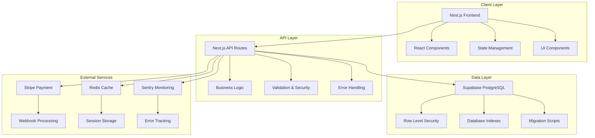
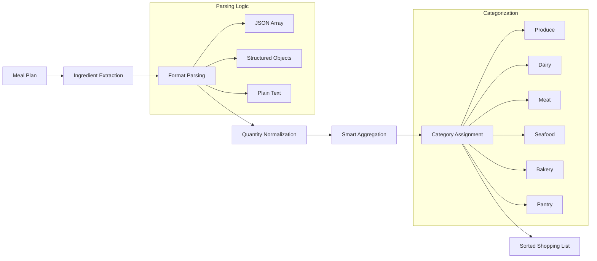
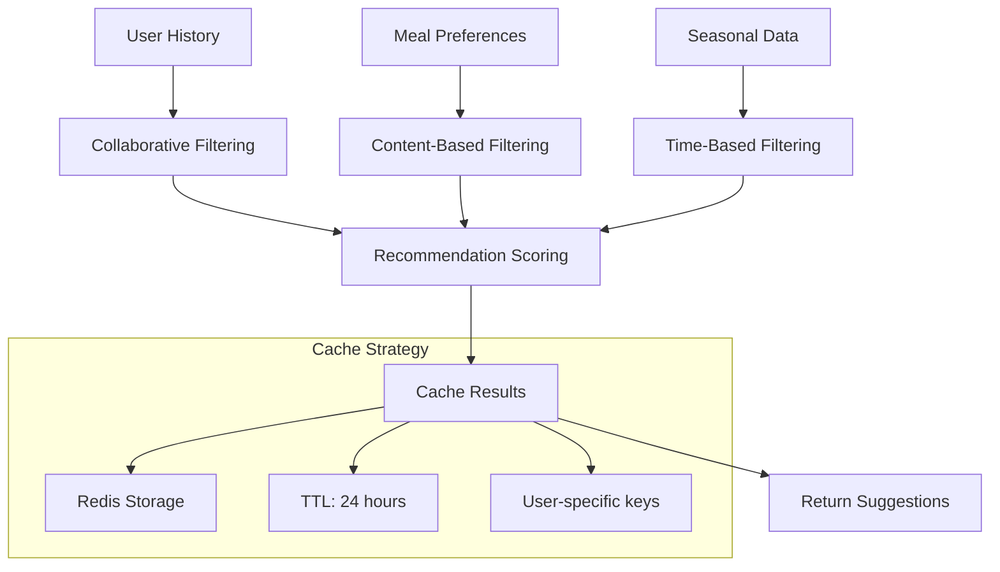

# BMAD Meal Planner - Technical Architecture Documentation

**Version**: 0.1.0  
**Date**: January 7, 2026  
**Analyst**: Mary (Business Analyst)  
**Document Type**: Technical Architecture Deep Dive  

---

## System Architecture Overview

The BMAD Meal Planner follows a modern full-stack architecture pattern with clear separation of concerns, scalable design principles, and comprehensive security measures.



---

## Frontend Architecture

### **Technology Stack Details**

#### **Core Framework**
- **Next.js 14.2.3**: App Router with Server Components
- **React 18**: Concurrent features and Suspense
- **TypeScript 5**: Full type safety and IDE support

#### **UI Framework & Styling**
- **Tailwind CSS v4**: Utility-first CSS framework
- **Shadcn/ui**: Component library built on Radix UI
- **Radix UI**: Accessible component primitives
- **Lucide React**: Icon library

#### **State Management**
- **Zustand**: Lightweight state management
- **React Query (@tanstack/react-query)**: Server state synchronization
- **React Hook Form**: Form state and validation
- **Zod**: Schema validation

### **Component Architecture**

#### **Directory Structure**
```
src/
├── app/                          # Next.js App Router
│   ├── (auth)/                  # Authentication group
│   │   ├── login/page.tsx       # Login interface
│   │   ├── signup/page.tsx      # Registration
│   │   └── profile/page.tsx     # User profile
│   ├── api/                     # API routes (18 endpoints)
│   │   ├── meals/               # Meal management APIs
│   │   ├── meal-plans/          # Planning APIs
│   │   ├── shopping-list/       # Shopping list API
│   │   ├── stripe/              # Payment processing
│   │   └── recommendations/     # AI suggestions
│   ├── meals/                   # Meal management pages
│   │   ├── page.tsx             # Meal library
│   │   ├── [id]/page.tsx        # Meal details
│   │   └── new/page.tsx         # Create meal
│   ├── meal-plans/              # Planning interface
│   │   ├── [id]/page.tsx        # Plan details
│   │   └── shopping-list/page.tsx # Generated lists
│   └── layout.tsx               # Root layout
├── components/                  # Reusable components
│   ├── shopping/                # Shopping list components
│   │   ├── PrintableShoppingList.tsx
│   │   └── ShoppingListGenerator.tsx
│   ├── meals/                   # Meal-related components
│   │   ├── MealCard.tsx
│   │   └── MealForm.tsx
│   └── ui/                      # Base UI components
│       ├── button.tsx
│       ├── dialog.tsx
│       └── form.tsx
├── hooks/                       # Custom React hooks
│   ├── useMeals.ts              # Meal data management
│   ├── useSubscription.ts       # Stripe subscription
│   └── useHaveItState.ts        # Shopping list state
├── lib/                         # Utility libraries
│   ├── supabase/                # Database clients
│   ├── shopping/                # Shopping list logic
│   ├── recommendations/         # AI engine
│   └── utils.ts                 # Common utilities
└── types/                       # TypeScript definitions
    └── meal.ts                  # Meal data types
```

#### **Key Components Analysis**

**PrintableShoppingList Component:**
```typescript
interface ExtendedItem extends ShoppingListItem {
  isChecked: boolean;  // Recently updated from 'checked'
  haveIt: boolean;     // User already has this item
}
```

**Shopping List Generation Pipeline:**
1. **Ingredient Extraction**: Parse meal ingredients from multiple formats
2. **Smart Aggregation**: Combine duplicate items with quantity math
3. **Categorization**: Sort into 6 categories (produce, dairy, meat, seafood, bakery, pantry)
4. **User State**: Track "have it" status and checked items

---

## Backend Architecture

### **Database Design (Supabase/PostgreSQL)**

#### **Schema Overview**
```sql
-- Core meal management
CREATE TABLE meals (
  id bigint PRIMARY KEY,
  user_id uuid REFERENCES auth.users(id),
  name text NOT NULL,
  meal_type text NOT NULL,
  description text,
  ingredients text,  -- JSON array or plain text
  instructions text,
  dietary_tags text[],
  last_prepared timestamptz,
  usage_count integer
);

-- Meal planning
CREATE TABLE meal_plans (
  id bigint PRIMARY KEY,
  user_id uuid REFERENCES auth.users(id),
  start_date date NOT NULL,
  end_date date NOT NULL
);

CREATE TABLE planned_meals (
  id bigint PRIMARY KEY,
  meal_plan_id bigint REFERENCES meal_plans(id),
  meal_id bigint REFERENCES meals(id),
  planned_for_date date NOT NULL,
  meal_type text CHECK (meal_type IN ('breakfast', 'lunch', 'dinner'))
);

-- User preferences
CREATE TABLE user_staples (
  id bigint PRIMARY KEY,
  user_id uuid REFERENCES auth.users(id),
  ingredient_name text NOT NULL,
  category text NOT NULL
);

-- Sharing functionality
CREATE TABLE meal_plan_shares (
  id bigint PRIMARY KEY,
  meal_plan_id bigint REFERENCES meal_plans(id),
  share_token text UNIQUE NOT NULL,
  expires_at timestamptz
);
```

#### **Security Architecture**
- **Row Level Security (RLS)**: All tables implement user-specific access
- **JWT Authentication**: Supabase Auth with secure token handling
- **API Security**: CORS configuration and request validation
- **Data Privacy**: User data isolation and encryption

### **API Architecture**

#### **RESTful Endpoints (18 total)**

**Meal Management APIs:**
```
GET    /api/meals              # List user meals
POST   /api/meals              # Create new meal
GET    /api/meals/[id]         # Get meal details
PUT    /api/meals/[id]         # Update meal
DELETE /api/meals/[id]         # Delete meal
POST   /api/meals/[id]/prepare # Mark as prepared
GET    /api/meals/suggestions  # Get AI suggestions
```

**Meal Planning APIs:**
```
GET    /api/meal-plans         # List meal plans
POST   /api/meal-plans         # Create meal plan
GET    /api/meal-plans/[id]    # Get plan details
PUT    /api/meal-plans/[id]    # Update plan
DELETE /api/meal-plans/[id]    # Delete plan
POST   /api/meal-plans/[id]/duplicate # Copy plan
POST   /api/meal-plans/[id]/share     # Create share link
```

**Shopping & Utility APIs:**
```
POST   /api/shopping-list      # Generate from plan
GET    /api/staples            # User staples
POST   /api/staples            # Add staple item
GET    /api/recommendations    # AI recommendations
```

**Payment APIs:**
```
POST   /api/stripe/checkout    # Create checkout session
POST   /api/stripe/portal      # Customer portal
POST   /api/stripe/webhook     # Stripe webhooks
```

#### **API Features**
- **OpenAPI Documentation**: Swagger UI integration
- **Request Validation**: Zod schema validation
- **Error Handling**: Consistent error responses
- **Rate Limiting**: Redis-based request throttling
- **Caching**: Redis for expensive operations

---

## Data Flow Architecture

### **Shopping List Generation Pipeline**



#### **Ingredient Processing Logic**

**Multi-Format Parser:**
```typescript
// Handles multiple input formats
interface Ingredient {
  name: string;
  quantity: number;
  unit: string;
}

// Supported formats:
// 1. JSON string: '[{"name": "eggs", "quantity": 2, "unit": ""}]'
// 2. Array of objects: [{name: "flour", quantity: 1, unit: "cup"}]
// 3. Plain text: "2 eggs, 1 cup flour, butter"
```

**Smart Quantity Extraction:**
```typescript
// Parses complex patterns like:
// "2 x 300g chicken breasts" → qty: 2, unit: "300g", name: "chicken breasts"
// "1/2 cup flour" → qty: 0.5, unit: "cup", name: "flour"
// "3 bananas" → qty: 3, unit: "", name: "bananas"
```

**Aggregation Algorithm:**
```typescript
function aggregateIngredients(ingredients: Ingredient[]): ShoppingListItem[] {
  const map = new Map<string, ShoppingListItem>();
  
  for (const ing of ingredients) {
    const key = `${normalizeName(ing.name)}|${ing.unit}`;
    if (map.has(key)) {
      map.get(key)!.quantity += ing.quantity;
    } else {
      map.set(key, {
        name: normalizeName(ing.name),
        quantity: ing.quantity,
        unit: ing.unit,
        category: categorizeIngredient(ing.name)
      });
    }
  }
  
  return Array.from(map.values())
    .sort((a, b) => a.category.localeCompare(b.category) || a.name.localeCompare(b.name));
}
```

### **Recommendation Engine Architecture**



#### **Recommendation Algorithm**
```typescript
interface MealSuggestionRequest {
  startDate?: string;
  days?: number;
  filters?: {
    mealTypes?: string[];
    dietaryTypes?: string[];
  };
}

interface MealSuggestionResponse {
  date: string;
  mealType: string;
  meal: Meal;
  reason?: string;  // AI-generated explanation
}
```

---

## Performance & Scalability

### **Database Optimization**

#### **Indexing Strategy**
```sql
-- User-based queries
CREATE INDEX idx_meals_user_id ON meals(user_id);
CREATE INDEX idx_meal_plans_user_id ON meal_plans(user_id);
CREATE INDEX idx_meal_plans_user_dates ON meal_plans(user_id, start_date DESC);

-- Relationship queries
CREATE INDEX idx_planned_meals_plan_id ON planned_meals(meal_plan_id);
CREATE INDEX idx_planned_meals_date ON planned_meals(planned_for_date);

-- Search optimization
CREATE INDEX idx_meals_name_gin ON meals USING gin(to_tsvector('english', name));
CREATE INDEX idx_meals_tags_gin ON meals USING gin(dietary_tags);
```

#### **Query Optimization**
- **RLS Policy Optimization**: Efficient user filtering
- **Join Optimization**: Proper foreign key relationships
- **Pagination**: Cursor-based for large datasets
- **Connection Pooling**: Supabase managed connections

### **Caching Strategy**

#### **Redis Implementation**
```typescript
// Cache keys structure
const CACHE_KEYS = {
  USER_MEALS: (userId: string) => `user:${userId}:meals`,
  MEAL_PLAN: (planId: string) => `plan:${planId}`,
  SHOPPING_LIST: (planId: string) => `shopping:${planId}`,
  RECOMMENDATIONS: (userId: string) => `recs:${userId}`,
  STAPLES: (userId: string) => `staples:${userId}`
};

// TTL strategies
const CACHE_TTL = {
  USER_MEALS: 3600,      // 1 hour
  MEAL_PLAN: 1800,       // 30 minutes
  SHOPPING_LIST: 7200,    // 2 hours
  RECOMMENDATIONS: 86400, // 24 hours
  STAPLES: 3600          // 1 hour
};
```

#### **Frontend Performance**
- **Code Splitting**: Next.js automatic route-based splitting
- **Image Optimization**: Next.js Image component with WebP
- **Bundle Analysis**: Regular bundle size monitoring
- **Lazy Loading**: Component-level lazy loading

---

## Security Architecture

### **Authentication & Authorization**

#### **Supabase Auth Integration**
```typescript
// Client-side authentication
const { data: { user } } = supabase.auth.getUser();

// Server-side authentication
const supabase = createClient();
const { data: { user } } = await supabase.auth.getUser();

// Middleware protection
export const middleware = async (req) => {
  const { data: { user } } = await supabase.auth.getUser(req.cookies.get('access_token'));
  if (!user && req.nextUrl.pathname.startsWith('/app')) {
    return NextResponse.redirect(new URL('/login', req.url));
  }
};
```

#### **Row Level Security (RLS)**
```sql
-- Example RLS policy for meals table
CREATE POLICY "Users can view their own meals"
  ON meals FOR SELECT
  USING (auth.uid() = user_id);

CREATE POLICY "Users can insert their own meals"
  ON meals FOR INSERT
  WITH CHECK (auth.uid() = user_id);
```

### **Data Security**
- **Encryption**: All data encrypted at rest and in transit
- **Input Validation**: Zod schema validation for all inputs
- **SQL Injection Prevention**: Parameterized queries only
- **XSS Protection**: React's built-in XSS protection
- **CSRF Protection**: SameSite cookies and CSRF tokens

### **API Security**
- **Rate Limiting**: Redis-based request throttling
- **CORS Configuration**: Restricted to allowed origins
- **API Key Management**: Environment variable storage
- **Request Logging**: Comprehensive audit trail

---

## Monitoring & Observability

### **Error Monitoring (Sentry)**
```typescript
import * as Sentry from "@sentry/nextjs";

Sentry.init({
  dsn: process.env.SENTRY_DSN,
  environment: process.env.NODE_ENV,
  tracesSampleRate: 1.0,
});
```

#### **Monitoring Coverage**
- **Frontend Errors**: JavaScript exceptions and React errors
- **API Errors**: Server-side exceptions and failed requests
- **Performance Metrics**: Page load times and API response times
- **User Sessions**: Error tracking by user session

### **Performance Monitoring**
- **Core Web Vitals**: LCP, FID, CLS tracking
- **API Performance**: Response time monitoring
- **Database Performance**: Query execution time
- **Cache Hit Rates**: Redis performance metrics

---

## Deployment Architecture

### **Production Environment**

#### **Infrastructure Components**
- **Frontend**: Vercel deployment (Next.js optimized)
- **Backend**: Supabase (PostgreSQL + Auth + Storage)
- **CDN**: Vercel Edge Network
- **Monitoring**: Sentry and Vercel Analytics
- **DNS**: Custom domain with SSL certificates

#### **Environment Configuration**
```typescript
// Production environment variables
NEXT_PUBLIC_SUPABASE_URL=***
NEXT_PUBLIC_SUPABASE_ANON_KEY=***
STRIPE_SECRET_KEY=***
STRIPE_WEBHOOK_SECRET=***
REDIS_URL=***
SENTRY_DSN=***
```

### **Development Workflow**
- **Local Development**: Docker Compose with local Supabase
- **Staging Environment**: Preview deployments on Vercel
- **CI/CD**: GitHub Actions with automated testing
- **Database Migrations**: Supabase migration system

---

## Technical Debt & Improvements

### **Current Technical Debt**

#### **High Priority Items**
1. **Ingredient Parsing**: Handle edge cases in plain text parsing
2. **Error Boundaries**: Implement comprehensive error boundaries
3. **Performance Optimization**: Optimize large meal plan loading
4. **Test Coverage**: Increase E2E test coverage

#### **Medium Priority Items**
1. **Mobile App**: React Native development
2. **Offline Support**: Service worker implementation
3. **Advanced Search**: Full-text search with filters
4. **Real-time Updates**: WebSocket integration

#### **Low Priority Items**
1. **Analytics Dashboard**: User behavior tracking
2. **Social Features**: Meal sharing and community
3. **Advanced AI**: Machine learning recommendations
4. **Multi-language Support**: i18n implementation

### **Scalability Improvements**

#### **Database Scaling**
- **Read Replicas**: For read-heavy operations
- **Partitioning**: Time-based partitioning for meal history
- **Connection Pooling**: PgBouncer implementation
- **Backup Strategy**: Automated backup and recovery

#### **Application Scaling**
- **Horizontal Scaling**: Load balancer configuration
- **CDN Optimization**: Global edge caching
- **API Rate Limiting**: Advanced rate limiting strategies
- **Microservices**: Potential service decomposition

---

## Conclusion

The BMAD Meal Planner demonstrates a well-architected, modern full-stack application with:

- **Scalable Architecture**: Designed for growth and performance
- **Security First**: Comprehensive security measures at all layers
- **Modern Tech Stack**: Current best practices and frameworks
- **Maintainable Code**: Clean architecture and comprehensive documentation
- **Production Ready**: Robust testing and monitoring capabilities

The technical foundation supports the current feature set while providing flexibility for future enhancements and scaling requirements.

---

*Technical documentation generated by BMAD Business Analyst on January 7, 2026*  
*For technical questions, contact the development team.*
